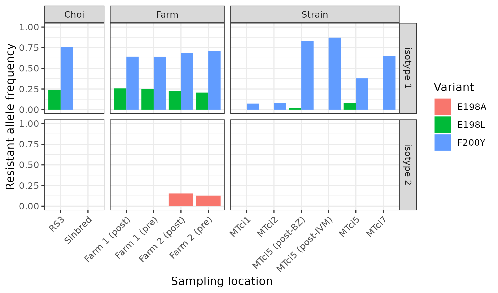

# T. circumcincta genome: beta tubulin analyses


### plotting jenni's blast results of beta-tubulin against pacbio subreads
```R
library(tidyverse)

data <- read.table("jm_blast.txt")

ggplot(data) + geom_segment(aes(x=V9, xend=V10, y=V7, yend=V8, col=V3), size=1) + guides(col="none") + facet_wrap(V2~.) + theme(strip.text.x = element_blank())

```


    [S1]     [E1]  |     [S2]     [E2]  |  [LEN 1]  [LEN 2]  |  [% IDY]  | [TAGS]
=====================================================================================
      19       97  |      723      645  |       79       79  |   100.00  | Z69258.1	scaffold_168
      19       97  | 20745262 20745340  |       79       79  |   100.00  | Z69258.1	scaffold_848
      96      207  | 20746086 20746201  |      112      116  |    94.83  | Z69258.1	scaffold_848
     206      565  | 20747075 20747496  |      360      422  |    84.83  | Z69258.1	scaffold_848
     206      434  | 20752910 20753140  |      229      231  |    94.89  | Z69258.1	scaffold_848
     566     1013  | 20747621 20748195  |      448      575  |    75.74  | Z69258.1	scaffold_848
     561      725  | 20753457 20753618  |      165      162  |    92.77  | Z69258.1	scaffold_848
     724      913  | 20753690 20753881  |      190      192  |    95.85  | Z69258.1	scaffold_848
    1012     1446  | 20748692 20749259  |      435      568  |    75.17  | Z69258.1	scaffold_848
    1012     1319  | 20754518 20754882  |      308      365  |    82.88  | Z69258.1	scaffold_848
    1317     1446  | 20754940 20755071  |      130      132  |    98.48  | Z69258.1	scaffold_848


HX9_42782:8:1119:20557:10626
TCTGATGACCCTGAAAAATCCCGATGATAGCGACTTTGTAGACGATGAACTGATGAGAAACAGATTTTTCCCATACTTCGGACTAAGGGATC|GATCTAATATAATAATCTGAATTTAGGGCTTCCAACTGACGCATTCTTTGGGAGGAGG


CGCTGGGCCGTTTCTTTTATGATTCTCGAAATCTGATGACATGAAAACTCCCGATGATCGCGACTTTGTCGACATGCACTGATGAGGAAACAGATTTTTCCCATACTTCGGACTACCGGGATCTCGAGAAACCTCTGGAATGAAG|TAAAGGTTCCTCCTTCCACGGAATCGCTCTAAATAAGTCATATACATAATATTCTCGCCAAACATTAACAAAACGTGCAAAT


ttttcccatactt

ccccactgtct - duplicated
taagtaacaagcttcttaa

bsub.py --threads 20 20 minimap_trimmed_reads "minimap2 -t 20 -a -o mapping.sam -x map-pb scaffolds_FINAL.fasta tcircumcincta.trimmedReads.fasta"


Potential break
20750542
20756174


TTAATTCCCCATGAAATCGGGTTTAAAGAAAGCTGTAAGTGCTTGAATGTTGCAATCTAGTGTTTTTAGAGGGATCAGCTCCGAAAACTCATAGAAAAGTGGTCCAACAGGTCGATTTTTGTCTCCATTAATGTTGAAATGGGTTCAT ATGTTAAAAAAGCACTGCTGGTTTTTTATTTATTTCCAG[GGGTGAAGTA]TTTCAAAGTTGAATCTGGAAAGTTATAGCAGTTCAAAGCCAGAAAACTAGC[GCTTTCTAAAAGT]GACGGAATTGTGCCTAAATAGACTATGATTCTTGCTCTGTCAGCAAATCGTTAGAAGTCAAAGTGAGCTACACCTGGATAAGTTATTAAAACTAATCTACTGACTGGCCTGTGTGCAGCAGCGCCTGAAAAGAAATTCCAGATCTCACACTAATACCTGTGATAATGGTTTTGTTGTCCGCCTCGAAGCATCAGTCCCAGCAGGGTCAAAGTGGGCGTGGAGGCCAACGATCACACCCCTCCCAAAAGCCGTGGAATCGCTTGATTAGCTGCGGAGACATTTGCGAT[CGTGAATCGAC]TCAAATAGTCCCTGTGGTCCCAGAACGGTCGCAAATGCCTCCACAGC[CGCGATCTCCAC]GGCTGGCAAGAGAGGGTGCGACCGCTGGCCGCCACGCCCATCTCGACAGGGT


## Fix b-tubulin duplication

```bash
ln -s ../HIC/SALSA2_CANU1.9_R2/salsa/scaffolds_FINAL.fasta

fastaq to_fasta -l0 scaffolds_FINAL.fasta scaffolds_FINAL.l0.fasta

samtools faidx scaffolds_FINAL.l0.fasta scaffold_848:20750500-20756220 > old_seq.fa

fastaq to_fasta -l0 old_seq.fa old_seq.l0.fa


sed 's/AACAGGTCGATTTTGTCTCCATTATGTTGAAATATGGTTCATACAGTTGCGGTCAAAAAGTTTGGAAACTTTTTCTTTTCAATCTAACGCAGTCATTAGGCAACGAAAGATGCCTCAAATTCAACATATTTATATACAAAATCAAGTGCGGAAATACGACGACTTGCAGGATTTCACAAAAACGGGAATCAGTTTGAAAAATTCAAATTTTTTTCAAAAAATGGCGCGTCAAAGTTGGAAACTCTGCAATTTTGAAACGAATTCAGCCACAATACCCTCCCATCCGCATGAGAACTCAAAAATTTGTTGAGTAGTTGTGTAATTTAACGATGGCGTCGTTTTTCAGCAACACTGAATCAGTTGTAACATCCTTCACAGGATCTGAAGTGAAATCCTACAGTTCGTTAGCTAAATCAAATTGTTCGGCAAAATTTTTGCTGAAACGCGGATGGAACGATATTCCGAGCCTCTTCTCTCATGGCGCCACCAACGCAATTATATTTCAAATCTTGACCTATTTCCTTCATTACAGCATTTTTTCTGAGTTCATAGGGCAAAACGGAGAAGGGTAGGCCTGCATCGGATCATTGTTTGATAGAAAAGCCATATTTCTCGGTCAGTCTAAACATTAAATGGTAGCATGCATTCTTACAGACTATCCTTAGATTAGGGCCAGCCCACTTTCGCTGGGTACTGAGAAGGGAGAAATTGCCCTGATGGTCCACACATCCTCGTCCTACGACACTGATCCACCATTCTCCTGAGCTTCGGAATATGATACCTAAAATGAGGTTCCCAATTGACGGATCACTTCACAAAGTTCACAGCATCATTCCCAGAAGGCAGTATTCGACTCGTCGCTGAGCAACAATTTTGTACCCCTAGCCTTCCGTCCATGTTCATCGCTTGTGGGCGGAAGCCTGTTGGGCCATTCTGCTCGAAAAGCCCAACGACGGCTCTTTGTTGAGACATTCTTTCTAATATTCGCTAGGCCCTAGCGGACGTATAGCAGCACTTCCGCTTGCGATCGACTGAGGGAAAACCCGAGAAAGTCGTTTTGTGTAGATGGTGACGGGGACGGGACGGCCGACCAGACTCAGGTCTTAGAAAAGGCCAATTCTTGTAAGTTTTTTTTGTAGCTGGGCCGTTTCGTTATGATTGCTCGACTCTGATGACCTGAAAAATCCCGATGATAGCGACTTTGTAGACGATGAACTGATGAGAAACAGATTTTTCCCATACTTCGGACTAAGGGATCTCGAGAAACCTCTGGAATGAAAGTANNNNNNNNNNNNNNNGTCTCAAGCGCAGTGATGGGCTGTATTCACCTGAATGTCCCCCCTCCTCCCAACGAAAAGAAGAACCCCGGTTATCTTGTAGAATAGGCATCATGTCGTTGTTCTCTGTCCTTTCTAATACGACCATACTTTGCTTTTAGTTCTGGGAAGGGAGCTCTGATGAGCACGGTATACCCCGATGGAACTTACAAGGAGAATCGGACCTGCTTGAAAGAATCAATGTATACTACAAGGGCAAGGGTTGGTTCAATTATATTCTACTATTTTGATTCTCATTTTCAATAAATTCAAATTAACCTTTTAAAAATGGTCTCGATACCTTTCCAGCTAAGCGGATTGCGTGACGTATGGCGATTGGTCGTTGGAGGGTGTACAAACCTGACATTCCTAACAGGTCAGCTTAGGAAACCAAATGAGACCTTGCAATTTGGCCTTTTAATTACACAGTTCTTCACAAGAAAAACAAGATTGCCCAAGCTGAACGCGCATGCACTGCGAGGCTGAACTTGGGTCTTGAAATGGCTGAGAGGGCCATAACCCCGTTCTATTATTATGGTGTGCATTTGAAGCATCAGAATGGTATGCTCGCAATGATTATCTCAGCTTTTTGCGCATCGAATGCGAAAGTGCTCCACCTGCTATATAGTGGGTCGTATTTTCAGTTGGTTGTGTAATGAAACATTTTTACAACTTCGTGGTGTTCGTGCTTTTCACCGACACGCTGAAGCTGCAAACTGGATCGGCAAATTCAGTTCTGCAGACGACACGTGGAGAGAGCATGTTTTCATCATGTAATGCGCTTTTCATTGCTCCTTTCTAGCTTAGCGCTAGTAAGTTTTATTAGCGTCAGGCGTAGAACTCTGACACTTGTTCTGGATCAACACGCATAATTAGGTCGTTGTGCGTATGCAATAATGACTACGATGAGGCTGAGTTTTCACCAACTGTCGAGATGAATTCAAAAATCTTCATTTGCTGTCACAAAAGGTCTTCATCAAAGCTCAAGTGACTAGCATTTAGTGTGCAGGTAGTCCTACTCATCCGGAGATGATTTACTTCATATATGTTAACATTGCATAGTGGTTCGGTACAACCTATGGGCAGAATTTTCAGGAGGAAAATATGTCCCACTGCTTGTGCTTGTTTCTCAGAGAGCCCGGAACAATGGACTCTGTTCGTTCTGGACCGTATGGACAACTTTTCCGTCCAGATAATTACGTGTTTGGCCAGTCAGGAGCGGGTAACAACTGGGCGAAGGGCCCTATACCGAGGGAGCTGAGCTTGTTGACAACGTCTTAGAGTTGTTGTTCGTAAAGAGGCAGAGGGTTGCGATTGCCTTCAGGTAGTTTTTCGTCGCACTTCGGCTGTCATTGAACCGATGATCAAAGATAATAATCTGAATTTAGGGCTTCCAATGACGCATTCTTTTCTTTTGGGGATGTACTGGTTTGCGGTATGGGAACGTTGCTCATCTCAAAAATTCGCGAGGAGTATCCGGATAGAATCATGGCTTCATTCTCCGTTGTTCCATCACCAAAGTAAAGTATCCCTACAGTAGTCCTTTTGAGATCGTATGTACAGGTTCTCGAGGTGCAATCCATTTACGAGCTCTTCACATTGATGCGCAAATTGTGAAATGTGCGAAGAAGTTATGTTTATAGGTTTCCGAGACCGTTGTGGAACCTACATATGCCACTCTTTCTGTACACCAGTTGGTTGAAAAGCCGACGAAACATTCTGCATCGATAATGAAGCTCTGTACGATCTGCTTCCGCACCTTAAAACTCACAAATCCAACTTATGGCGATCTCAATCACTTAGGTGAGGTTTTATATAGGTTTTATGAGTATTAGCTTACTGCCACTTTTTAATGTATTGTATTGTGGTTTTGCAGTGTCTGTCACAATGTCTGGAGTCACGACCTGCCTTCGATTCCCTGGACAGTTGAATGCTGATCTTCGCAATTGGCTGTGAACATGGTTCCATTCCCTCGTCTTCACTTCTTCCTGCCAGGTTTCGCCCCACTGTCTGCTAAGGGTGGCTCAAGCGTATCGCGCTTTTCAACTGTCGCTGAGCTTACACAGGCAAGTATGTGGATTGCTTTCTGTTGAGGAAGGTCGATGCATGTGATAATGATTTTTCAGATGTTTGATGCCAAAACATGATGGCTGCTGGCGATCCTCGCCACGACGCTATCTCACGTGGCGGCCATGTTCCGTGGTCGCATGAGCATGGCGGTAAGGCCTTCTTGAACTTTCCTCAAATAACCTGGTCCTCTCATAGTGTCGTGAGGGTGGGGACGAACCCAATTCTTGGTTACGGTAACAGTCGGTTACTCCTGATAGTGGCGAGACTGAAAGATTTTACATTGGTGGCATCATTGATAACTTAACAGGTTCCTGTGGTGTACGGAATAGGATCAGTTGAAATCATGCGCAGTATACGCGGCGTTTTGCCGTGACGACCATACCAGAATCGTGGTTGTGGTTTTGCCCCCTTCAGAGTGTAACGAGTTCGATTTCCCACGACTCTTTGTGTAACAGTAACATTTATGATAATCTCGTTGCATGTCATGGAATAAGATTGTGATAGAGCGATCAAAATTCATACTTGAGGGGTAGGCTCTGCAAAATGAGGTAGATGTCGTGTCCATTTTCCCAAGTTATCCTTGATTTGTGGGGAAGGAAGGAGAATCAAGTAAATGCATTTTGTTACATTCAGGAAGTGGACGACCAAATGATGTCCGTGCAGAACAAGAACCTCGTCATAACTTCGTGGAATGGATTCCAAACAACGTAAAAACCGCTGTTGTGACATTCCTCCTCGTGGATGAAATGGCTGCTACCTTTGTTGGTAACTCAACTGCCATCCAAGAGCTGTTCAAGCGTATTCGGAGCAGTTCACAGGTTTGTATTCTGAAGGACCTGTGCGCGCTTGTTGCATTATGGAATGTTCACCGTTTTAGCTATGTTCCGGCGCAAGGCTTTCCTCCATTGGTACACTGGTGAGGGTATGGACGAAATGGAATTCACAGAAGCTGAGTCGAACATGAATGATCTTATCTCTGAGTACCAACAGTACCAGGTTTGTTTTCGTTAATTTGCTGTTACACATTAGTTCAAAGCGCCATTTTTCAAATTTAAGGAGGCCACCGCTGACGATATGGGCGATCTCGATGCAGAAGGTGCAGAAGAGCCGTACCCCGAGGAGTAATGATCCACCGTGTTGCGCTGTTTTTTTTCTGTGTCAATGCGAAATACACATTGGTTGCGTTGCTATTCAAGAATCTTTCCTAAATAATAACTTTATTGTGGTATTATCACGAGAAGATCGCAGTGAATTTGGTTTTGGACACCACAGTCAAGGTTCAAAAATCAAAGCTTTTTATGTTTGCACTGCCCTGTCGCTAAACGCTGAATTATGTACTTGCCGTTATAGTATTATTCAAGCTTCTAATGTATAAAGTAATTGAAATTAAAAACCAGCCGACAGATGCAGTGTCAGTGAAAATTGAGAAATAAATTAAGGCGGGAGGGGTTGTGAGCACATGTTGGTTCAGTATGGTGTAAGGCTTTGTCTGAAGGAATCTTCTCTGGAAGAATCGTGATTCTATCTCTCACTTCATGAATCGCTGGCTTGAGGCGCATTGTTCACGATAAGGACGGAGAGAACAAGGAGTTGCGTTTGCTGTGGTAAACACTGGACTGACTGCAGCGTTCAAATTCCGCCGTACAGTTGTCACAAGTCCGAGAGGGGTTGTATTGGCCGACGAGAAACGGTCCCGCGTCGAGTCCGGTGAAGGGTTCAAGTTACGAGGGCTTTTTTGACTATAGAACGCCCACTTCGAAGCCTAGTCAAGAATGTAAGAAGTGTGTGACTGATCAAAAAACTCACTTGGAAGACCGCTAGAAGGGAGCTGGAGCGGCGTGGCCGGAATCGGCCGATGGGATTGCAGCCGGTTTCGACCACGTCCACCCTGCTGGGACTAATGCTTTGAGCAAAAACGTGTGCATGGCTCATCTCAGAGCAGGAGAGTCACTCGAAAGTAGCCATATTTAATCCATATTTAACTGTTCGTGCACAAATATCGCTCTACAGAAAAGCCAATGTCTTCAAACTACATCTATGTTAGTGAAAGAGTGCCATTGGGGTAGATTGACTCCCAAAGCTTTACAGAGTTGTCTGCTGGCGACTTTCTGAAAAGGGTTTTGTATCGAATGATGATCATTATTCCCCATGAAATCGGGTTGTTAAAGAAAGCTGTAAGTGCTTGAATTTGCAATCTAGTGTTTTTAGGGGATCAGCTCCGAAAACTCATAGAAAGTGGTCCAACAGGTCGATTTTTGTCTCCATTAATGTTGGGTGAAATGGTTCATATGTTAAAAAAGCACTGGCCTTTATTTATTTCCAGGGGTGAAGTATT/AACAGGTCGATTTTGTCTCCATTATGTTGAAATATGGTTCATATGTTAAAAAAGCACTGGCCTTTATTTATTTCCAGGGGTGAAGTATT/' scaffolds_FINAL.l0.fasta > scaffolds_FINAL.btubfix.fasta

```


## Calculated frequence of variants associated with resistance to BZ in beta-tubulins

```bash
cat btubulin_variant_positions.txt
tci2_wsi3.0_chr_1	62291012
tci2_wsi3.0_chr_1	62291019
tci2_wsi3.0_chr_2	59150243


vcftools --gzvcf TCIRC.raw.vcf.gz --extract-FORMAT-info AD --out btubulin_variant_positions --positions btubulin_variant_positions.txt

# convert allele count data to variant frequency
grep "^tci2_wsi3.0" btubulin_variant_positions.AD.FORMAT | awk -F '[\t, ]' '{print $1, $2, $4/($3+$4), $6/($5+$6), $8/($7+$8), $10/($9+$10), $12/($11+$12), $14/($13+$14), $16/($15+$16), $18/($17+$18), $20/($19+$20), $22/($21+$22), $24/($23+$24), $26/($25+$26), $28/($27+$28), $30/($29+$30), $32/($31+$32)}' OFS="\t" > btubulin_variant_positions.AD_freq

# note: removed the second position, ie 59150244, from the data to simplify the plotting
# 59150244 and 59150243 variants are inherited together
```

```R
# load libraries
library(reshape2)
library(ggplot2)
library(dplyr)
library(stringr)
library(tidyr)
library(rstatix)

# reformat data
btub_data <- read.table("btubulin_variant_positions.AD_freq")

colnames(btub_data) <- c("CHROM", "POS",	"Farm 1 (post)",	"Farm 1 (pre)",	"Farm 2 (post)",	"Farm 2 (post) B",	"Farm 2 (pre)",	"Farm 2 (pre) B",	"MTci1",	"MTci2",	"MTci2_pool_L4",	"MTci5 (post-BZ)",	"MTci5 (post-IVM)",	"MTci5",	"MTci7",	"RS3",	"Sinbred")

btub_data <- btub_data %>% select("CHROM", "POS",	"Farm 1 (post)",	"Farm 1 (pre)",	"Farm 2 (post)",	"Farm 2 (pre)",	"MTci1",	"MTci2",	"MTci5 (post-BZ)",	"MTci5 (post-IVM)",	"MTci5",	"MTci7",	"RS3",	"Sinbred")

btub_data$gene <- c("isotype 1", "isotype 1",  "isotype 2")

btub_data_melt <- melt(btub_data,  id = c("CHROM",  "POS", "gene"),  variable.name = "SAMPLE_ID")

btub_data_melt$group <- c(rep("Farm", 12), rep("Strain", 18), rep("Choi", 6) )

colnames(btub_data_melt) <- c("CHR", "POS", "GENE", "SAMPLE_ID", "ALLELE_FREQ", "GROUP")

btub_data_melt <-
     btub_data_melt %>%
     mutate(POS = str_replace(POS,  "62291012",  "E198L")) %>% 
     mutate(POS = str_replace(POS,  "62291019", "F200Y")) %>% 
     mutate(POS = str_replace(POS,   "59150243", "E198A"))

# make the figure
ggplot(btub_data_melt, aes(x = SAMPLE_ID, y = ALLELE_FREQ, fill = factor(POS))) +
     geom_bar(position = "dodge",  stat = "identity") +
     labs(x="Sampling location",  y="Resistant allele frequency",  fill = "Variant") +
     theme_bw() + theme(axis.text.x = element_text(angle = 45, hjust=1)) +
     ylim(0,1) +
     facet_grid(GENE ~ GROUP, space="free_x", scales="free_x")

# save it
ggsave("figure_betatubulin_variants.pdf", width=170, height=100, units="mm")
ggsave("figure_betatubulin_variants.png", width=170, height=100, units="mm")

```
