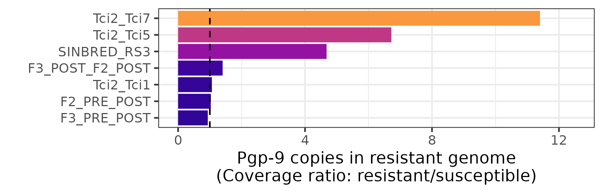

```bash
cd /nfs/users/nfs_s/sd21/lustre_link/teladorsagia_circumcincta/DRUG_POPGEN/POOLSEQ/ANALYSIS/CNV

cp ../../../../GENOME/ANNOTATION/V3/teladorsagia_circumcincta_tci2_wsi3.0.annotation.gff3 .

# extract CDS coords
grep "CDS" teladorsagia_circumcincta_tci2_wsi3.0.annotation.gff3 |\
    awk -F '[\t;]' '{print $1,$4,$5,$10}' OFS="\t" |\
    cut -d "-" -f1 |\
    sed 's/Parent=//g' > cds.bed


bedtools multicov -bams RS3.bam SINBRED.bam -bed cds.bed > RS3_SINBRED.bed.cov

bedtools multicov -bams F2_PRE.bam F2_POST.bam -bed cds.bed > F2_PRE_POST.bed.cov

```


```R

# plot <- function(file) {

# library(tidyverse)
# library(ggrepel)


# data <- read.delim(file, header=F)

# data_means <- data %>% group_by(V4) %>% summarise(mean_1 = mean(V5), mean_2= mean(V6))

# data_means_sorted <- data_means %>% 
#     arrange(mean_1) %>% 
#     mutate(ratio=mean_2/mean_1) %>% 
#     filter_all(all_vars(!is.infinite(.))) %>% 
#     filter_all(all_vars(!is.nan(.)))

# ggplot(data_means_sorted, aes(reorder(V4,-mean_1),log10(mean_2), col=log(ratio))) + 
#     geom_point(size=0.5) + 
#     geom_hline(yintercept = log10(median(data_means_sorted$mean_2)), linetype="dashed", size=0.5) +
#     geom_text_repel(data = . %>% 
#                     mutate(label = ifelse((mean_1/mean_2) > 4, V4, "")),
#                   aes(label=label), 
#                   box.padding = 1,
#                   show.legend = FALSE, 
#                   max.overlaps=100, 
#                   size=3) +
#     geom_text_repel(data = . %>% 
#                     mutate(label = ifelse((mean_2/mean_1) > 4, V4, "")),
#                   aes(label=label), 
#                   box.padding = 1,
#                   show.legend = FALSE, 
#                   max.overlaps=100, 
#                   size=3) +
#     scale_colour_gradient2(low = "blue",
#         mid = "grey",
#          high = "blue")

# }
```

```R

plot <- function(file) {

library(tidyverse)
library(ggrepel)


data <- read.delim(file, header=F)

data_means <- data %>% group_by(V4) %>% summarise(mean_1 = mean(V5), mean_2= mean(V6))

data_means_sorted <- data_means %>% 
    arrange(mean_1) %>% 
    mutate(ratio=mean_2/mean_1) %>% 
    filter_all(all_vars(!is.infinite(.))) %>% 
    filter_all(all_vars(!is.nan(.)))

ggplot(data_means_sorted, aes(reorder(V4,-mean_1),log10(mean_2), col=log(ratio))) + 
    geom_point(size=0.5) + 
    geom_hline(yintercept = log10(median(data_means_sorted$mean_2)), linetype="dashed", size=0.5) +
    geom_text_repel(data = . %>% 
                    mutate(label = ifelse(V4 == "TCIR_00132080", V4, "")),
                  aes(label=label), 
                  box.padding = 1,
                  show.legend = FALSE, 
                  max.overlaps=Inf, 
                  size=3) +
    scale_colour_gradient2(low = "blue",
        mid = "grey",
        high = "blue") +
    labs(y="Coverage of\nresistant group (log10)", x="") +
    theme(axis.title.x=element_blank(),axis.text.x=element_blank(), axis.ticks.x=element_blank(), panel.border = element_rect(colour = "black", fill=NA, linewidth=1))


}

library(patchwork)

a <- plot("F2_PRE_POST.bed.cov")
b <- plot("F3_PRE_POST.bed.cov")
c <- plot("F3_POST_F2_POST.bed.cov")
d <- plot("SINBRED_RS3.bed.cov")
e <- plot("Tci2_Tci1.bed.cov")
f <- plot("Tci2_Tci5.bed.cov")
g <- plot("Tci2_Tci7.bed.cov")


a+b+c+d+e+f+g + plot_layout(ncol=1)
ggsave("gene_coverage_ratios_pgp-9.pdf", height=200, width=170, units="mm")


stat <- function(file) {

library(tidyverse)

data <- read.delim(file, header=F)

data_means <- data %>% group_by(V4) %>% summarise(mean_1 = mean(V5), mean_2= mean(V6))

data_means_sorted <- data_means %>% 
    arrange(mean_1) %>% 
    mutate(ratio=mean_2/mean_1) %>% 
    filter_all(all_vars(!is.infinite(.))) %>% 
    filter_all(all_vars(!is.nan(.)))

data_means_sorted %>% filter(V4=="TCIR_00132080") %>% mutate(name=file) %>% mutate(name = gsub(".bed.cov", "", name))

}

library(tidyverse)

F2_PRE_POST <- stat("F2_PRE_POST.bed.cov")
F3_PRE_POST <- stat("F3_PRE_POST.bed.cov")
F3_POST_F2_POST <- stat("F3_POST_F2_POST.bed.cov")
choi <- stat("SINBRED_RS3.bed.cov")
Tci2_Tci1 <- stat("Tci2_Tci1.bed.cov")
Tci2_Tci5 <- stat("Tci2_Tci5.bed.cov")
Tci2_Tci7 <- stat("Tci2_Tci7.bed.cov")

data <- bind_rows(F2_PRE_POST, F3_PRE_POST, F3_POST_F2_POST, choi, Tci2_Tci1, Tci2_Tci5, Tci2_Tci7)

library(viridis)

ggplot(data, aes(x = reorder(name, ratio), y = ratio, fill=ratio)) + 
    geom_col() +
    geom_hline(yintercept=1, linetype="dashed") +
    labs(y="Pgp-9 copies in resistant genome\n(Coverage ratio: resistant/susceptible)", x="") +
    ylim(0,12.5) +
    coord_flip() +
    scale_fill_viridis(option="plasma", limits=c(0,15)) +
    theme_bw() + theme(legend.position="none")

ggsave("pgp-9_copy_number.png", height=40, width=125, units="mm")
ggsave("pgp-9_copy_number.pdf", height=40, width=125, units="mm")

```



## Checking copy number of betatubulin isotype 2

```R

plot <- function(file) {

library(tidyverse)
library(ggrepel)


data <- read.delim(file, header=F)

data_means <- data %>% group_by(V4) %>% summarise(mean_1 = median(V5), mean_2= median(V6))

data_means_sorted <- data_means %>% 
    arrange(mean_1) %>% 
    mutate(ratio=mean_2/mean_1) %>% 
    filter_all(all_vars(!is.infinite(.))) %>% 
    filter_all(all_vars(!is.nan(.)))

ggplot(data_means_sorted, aes(reorder(V4,-mean_1),log10(mean_2), col=log(ratio))) + 
    geom_point(size=0.5) + 
    geom_hline(yintercept = log10(median(data_means_sorted$mean_2)), linetype="dashed", linewidth=0.5) +
    geom_text_repel(data = . %>% 
                    mutate(label = ifelse(V4 == "TCIR_10059730", V4, "")),
                  aes(label=label), 
                  box.padding = 1,
                  show.legend = FALSE, 
                  max.overlaps=Inf, 
                  size=3, 
                  colour="black") +
    scale_colour_gradient2(low = "blue",
        mid = "grey",
        high = "blue") +
    labs(y="Coverage of\nresistant group (log10)", x="") +
    theme(axis.title.x=element_blank(),axis.text.x=element_blank(), axis.ticks.x=element_blank(), panel.border = element_rect(colour = "black", fill=NA, linewidth=1))


}

library(patchwork)

a <- plot("F2_PRE_POST.bed.cov")
b <- plot("F3_PRE_POST.bed.cov")
c <- plot("F3_POST_F2_POST.bed.cov")
d <- plot("SINBRED_RS3.bed.cov")
e <- plot("Tci2_Tci1.bed.cov")
f <- plot("Tci2_Tci5.bed.cov")
g <- plot("Tci2_Tci7.bed.cov")


a+b+c+d+e+f+g + plot_layout(ncol=1)