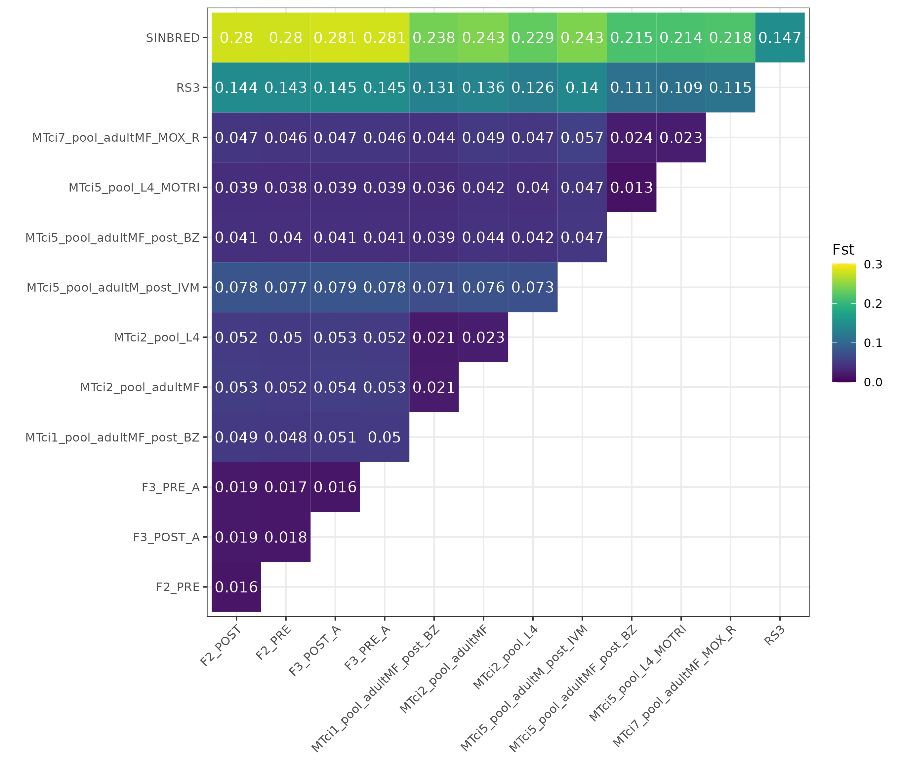
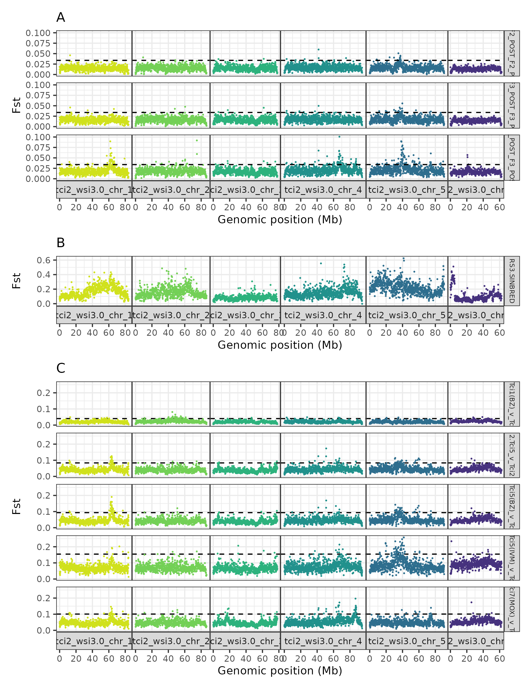
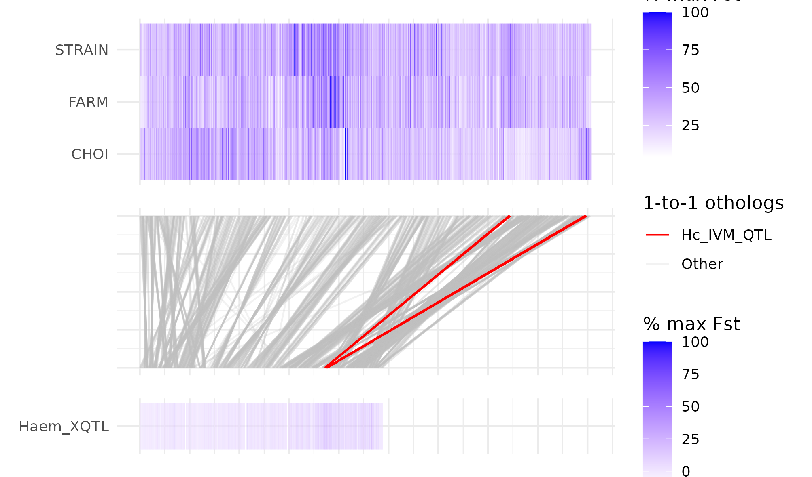

# Teladorsagia circumcincta genome analysis: genome-wide analyses

### author: Stephen Doyle, stephen.doyle[at]sanger.ac.uk

## Overall aims
- to identifiy regions of the genome containing genes associated with drug treatment response
- analysing several different datasets, each with different sets fo samples that response differently to drug treatment
- analysing all in a similar way will hopefully reveal drug-treatment specific QTLs


## Sample sets
- "Choi"
    - reanalysis of published data from a backcross between suceptible and multidrug resistant stains
- "Farms"
    - from Jenni's PhD, focused on sampling pre and post treatment of two UK farms
- "Strains"
    - archival strains Tci1, Tci5 and Tci7


```bash
# strain data sequenced at Sanger, so need to retrieve it from iRODs
cd /nfs/users/nfs_s/sd21/lustre_link/teladorsagia_circumcincta/DRUG_POPGEN/POOLSEQ/DATA

module load irods_extractor/v3.0.10

irods_extractor --studyid 7548 --runid 48426
```


## mapping
```bash
cd /nfs/users/nfs_s/sd21/lustre_link/teladorsagia_circumcincta/DRUG_POPGEN/POOLSEQ

module load mapping-helminth/v1.0.8

bsub.py --queue yesterday 1 mapping_poolseq "mapping-helminth --input sample_manifest.txt --reference teladorsagia_circumcincta_tci2_wsi3.0.genome.fa"

```

where "sample_manifest.txt" is: 
```bash
ID,R1,R2
F2_POST,/nfs/users/nfs_s/sd21/lustre_link/teladorsagia_circumcincta/POOLSEQ/DATA/Farm2_Post_1.fq.gz,/nfs/users/nfs_s/sd21/lustre_link/teladorsagia_circumcincta/POOLSEQ/DATA/Farm2_Post_2.fq.gz
F2_PRE,/nfs/users/nfs_s/sd21/lustre_link/teladorsagia_circumcincta/POOLSEQ/DATA/Farm2_Pre_1.fq.gz,/nfs/users/nfs_s/sd21/lustre_link/teladorsagia_circumcincta/POOLSEQ/DATA/Farm2_Pre_2.fq.gz
F3_POST_A,/nfs/users/nfs_s/sd21/lustre_link/teladorsagia_circumcincta/POOLSEQ/DATA/Farm3_PostA_1.fq.gz,/nfs/users/nfs_s/sd21/lustre_link/teladorsagia_circumcincta/POOLSEQ/DATA/Farm3_PostA_2.fq.gz
F3_POST_B,/nfs/users/nfs_s/sd21/lustre_link/teladorsagia_circumcincta/POOLSEQ/DATA/Farm3_PostB_1.fq.gz,/nfs/users/nfs_s/sd21/lustre_link/teladorsagia_circumcincta/POOLSEQ/DATA/Farm3_PostB_2.fq.gz
F3_PRE_A,/nfs/users/nfs_s/sd21/lustre_link/teladorsagia_circumcincta/POOLSEQ/DATA/Farm3_PreA_1.fq.gz,/nfs/users/nfs_s/sd21/lustre_link/teladorsagia_circumcincta/POOLSEQ/DATA/Farm3_PreA_2.fq.gz
F3_PRE_B,/nfs/users/nfs_s/sd21/lustre_link/teladorsagia_circumcincta/POOLSEQ/DATA/Farm3_PreB_1.fq.gz,/nfs/users/nfs_s/sd21/lustre_link/teladorsagia_circumcincta/POOLSEQ/DATA/Farm3_PreB_2.fq.gz
RS3,/nfs/users/nfs_s/sd21/lustre_link/teladorsagia_circumcincta/POOLSEQ/DATA/RS3_1.fq.gz,/nfs/users/nfs_s/sd21/lustre_link/teladorsagia_circumcincta/POOLSEQ/DATA/RS3_2.fq.gz
SINBRED,/nfs/users/nfs_s/sd21/lustre_link/teladorsagia_circumcincta/POOLSEQ/DATA/Sinbred_1_1.fq.gz,/nfs/users/nfs_s/sd21/lustre_link/teladorsagia_circumcincta/POOLSEQ/DATA/Sinbred_1_2.fq.gz
s
```


```bash
OUTPUT_DIR=/nfs/users/nfs_s/sd21/lustre_link/teladorsagia_circumcincta/POOLSEQ/ANALYSIS
find ~+ -type f -name '*.bam*' -exec ln -vs "{}" $OUTPUT_DIR/ ';'


cd /nfs/users/nfs_s/sd21/lustre_link/teladorsagia_circumcincta/POOLSEQ/ANALYSIS


bsub.py --queue long 10 grenedalf_div \
"grenedalf diversity \
--filter-sample-min-coverage 10 \
--filter-sample-max-coverage 100 \
--pool-sizes 800 \
--window-type sliding \
--window-sliding-width 100000 \
--write-pi-tables \
--separator-char tab \
--sam-path RS3.bam \
--sam-path SINBRED.bam"


# farm data
bsub.py 1 grendalf_farm_fst \
"grenedalf fst \
--reference-genome-fasta-file teladorsagia_circumcincta_tci2_wsi3.0.genome.fa \
--allow-file-overwriting \
--method unbiased-nei \
--file-prefix tc_jm_farm_poolseq \
--sam-min-map-qual 30 \
--sam-min-base-qual 30 \
--filter-sample-min-count 2 \
--filter-sample-min-coverage 10 \
--filter-sample-max-coverage 100 \
--pool-sizes 182 \
--window-type sliding \
--window-sliding-width 100000 \
--write-pi-tables \
--separator-char tab \
--sam-path F2_POST.bam \
--sam-path F2_PRE.bam \
--sam-path F3_POST_A.bam \
--sam-path F3_POST_B.bam \
--sam-path F3_PRE_A.bam \
--sam-path F3_PRE_B.bam"

# choi data
bsub.py 1 grendalf_choi_fst \
"grenedalf fst 
--reference-genome-fasta-file teladorsagia_circumcincta_tci2_wsi3.0.genome.fa \
--allow-file-overwriting \
--method unbiased-nei \
--file-prefix tc_choi_poolseq \
--sam-min-map-qual 30 \
--sam-min-base-qual 30 \
--filter-sample-min-count 2 \
--filter-sample-min-coverage 10 \
--filter-sample-max-coverage 100 \
--pool-sizes 800 \
--window-type sliding \
--window-sliding-width 100000 \
--write-pi-tables \
--separator-char tab \
--sam-path RS3.bam \
--sam-path SINBRED.bam"

# strain data
bsub.py 1 grendalf_choi_fst \
"grenedalf fst \
--reference-genome-fasta-file teladorsagia_circumcincta_tci2_wsi3.0.genome.fa \
--allow-file-overwriting \
--method unbiased-nei \
--file-prefix tc_strains_poolseq \
--sam-min-map-qual 30 \
--sam-min-base-qual 30 \
--filter-sample-min-count 2 \
--filter-sample-min-coverage 10 \
--filter-sample-max-coverage 100 \
--pool-sizes 200 \
--window-type sliding \
--window-sliding-width 100000 \
--write-pi-tables \
--separator-char tab \
--sam-path MTci1_pool_adultMF_post-BZ.bam \
--sam-path MTci2_pool_adultMF.bam \
--sam-path MTci2_pool_L4.bam \
--sam-path MTci5_pool_adultMF_post-BZ.bam \
--sam-path MTci5_pool_adultM_post-IVM.bam \
--sam-path MTci5_pool_L4_MOTRI.bam \
--sam-path MTci7_pool_adultMF_MOX-R.bam"
```


```bash
# strain data
bsub.py 1 grendalf_all_fst \
"grenedalf fst \
--reference-genome-fasta-file teladorsagia_circumcincta_tci2_wsi3.0.genome.fa \
--allow-file-overwriting \
--method unbiased-nei \
--file-prefix tc_strains_poolseq \
--sam-min-map-qual 30 \
--sam-min-base-qual 30 \
--filter-sample-min-count 2 \
--filter-sample-min-coverage 10 \
--filter-sample-max-coverage 100 \
--pool-sizes 200 \
--window-type sliding \
--window-sliding-width 100000 \
--write-pi-tables \
--separator-char tab \
--sam-path MTci1_pool_adultMF_post-BZ.bam \
--sam-path MTci2_pool_adultMF.bam \
--sam-path MTci2_pool_L4.bam \
--sam-path MTci5_pool_adultMF_post-BZ.bam \
--sam-path MTci5_pool_adultM_post-IVM.bam \
--sam-path MTci5_pool_L4_MOTRI.bam \
--sam-path MTci7_pool_adultMF_MOX-R.bam \
--sam-path RS3.bam \
--sam-path SINBRED.bam \
--sam-path F2_POST.bam \
--sam-path F2_PRE.bam \
--sam-path F3_POST_A.bam \
--sam-path F3_PRE_A.bam"


cat tc_strains_poolseqfst.csv | head -n1 | sed -e 's/\.1//g' -e  's/\-/_/g' > header
cat tc_strains_poolseqfst.csv | grep -v "chrom" > data

cat header data > tc_strains_poolseqfst.clean.txt
```

```R
library(tidyverse)
library(viridis)

# Read data
data <- read.delim("tc_strains_poolseqfst.clean.txt", sep="\t")

# Filter and select relevant data
data <- data %>%
  filter(grepl("tci2_wsi3.0_chr", chrom)) %>%
  filter(!grepl("tci2_wsi3.0_chrX", chrom)) %>%
  filter(!grepl("tci2_wsi3.0_chr_mtDNA", chrom)) %>%
  select(-chrom, -start, -end, -snps)

# Summarize data by taking the mean of each numeric column
data2 <- data %>%
  summarise(across(where(is.numeric), ~ mean(.x, na.rm = TRUE)))

# Reshape data from wide to long format
data3 <- data2 %>%
  gather(key = "group", value = "fst", 1:78)


# Separate the 'group' column into two new columns 'A' and 'B'
data4 <- data3 %>%
  separate(group, into = c("A", "B"), sep = "\\.")

# Create a tibble with all pairwise combinations
all_combinations <- expand.grid(A = unique(data4$A), B = unique(data4$B))
# Ensure the tibble contains both A-B and B-A combinations
all_combinations <- bind_rows(all_combinations, 
                              all_combinations %>% rename(A = B, B = A)) %>%
  distinct()

# Join the summarized Fst data with all combinations to fill in missing pairs
data_complete <- all_combinations %>%
  left_join(data4, by = c("A", "B"))

# Fill in NA values with the corresponding values from the opposite pair (B-A)
data_complete <- data_complete %>%
  left_join(data4, by = c("A" = "B", "B" = "A"), suffix = c("", ".y")) %>%
  mutate(fst = ifelse(is.na(fst), fst.y, fst)) %>%
  select(A, B, fst)

# Filter to show only the upper triangle
data_upper <- data_complete %>%
  filter(A < B)

# Create a heatmap using ggplot2
ggplot(data_upper) +
  geom_tile(aes(x = A, y = B, fill = fst)) +
  geom_text(aes(x = A, y = B, label = round(fst, digits = 3)), colour = "white") +
  scale_fill_viridis(limits=c(0,0.301)) +
  theme_bw() +
  labs(x = "", y = "", fill="Fst") +
  theme(axis.text.x = element_text(angle = 45, hjust = 1))


ggsave("pairwise_Fst_allsamples.png", height=200, width=230, units="mm")
ggsave("pairwise_Fst_allsamples.pdf", height=200, width=230, units="mm")

```



## Comparion of different samples - PCA
- want to try make a PCA using variant frequencies of the pooled sequencing data
- restricting it to coding sequence variation, hence using the GFF
- also adding a more stringent coverage cutoff, to increase the signal

```bash
ln -s ../../../GENOME/ANNOTATION/V3/teladorsagia_circumcincta_tci2_wsi3.0.annotation.gff3

bsub.py 1 grendalf_all_freq \
"grenedalf frequency \
--reference-genome-fasta-file teladorsagia_circumcincta_tci2_wsi3.0.genome.fa \
--allow-file-overwriting \
--multi-file-locus-set intersection \
--file-prefix tc_poolseq_freq \
--sam-min-map-qual 30 \
--sam-min-base-qual 30 \
--filter-region-gff teladorsagia_circumcincta_tci2_wsi3.0.annotation.gff3 \
--write-sample-alt-freq \
--write-sample-coverage \
--write-total-coverage \
--separator-char tab \
--sam-path MTci1_pool_adultMF_post-BZ.bam \
--sam-path MTci2_pool_adultMF.bam \
--sam-path MTci2_pool_L4.bam \
--sam-path MTci5_pool_adultMF_post-BZ.bam \
--sam-path MTci5_pool_adultM_post-IVM.bam \
--sam-path MTci5_pool_L4_MOTRI.bam \
--sam-path MTci7_pool_adultMF_MOX-R.bam \
--sam-path RS3.bam \
--sam-path SINBRED.bam \
--sam-path F2_POST.bam \
--sam-path F2_PRE.bam \
--sam-path F3_POST_A.bam \
--sam-path F3_PRE_A.bam"


# need to add some additional filters, eg coverage

coverage=20
cat tc_poolseq_freqfrequency.csv | awk -v coverage=${coverage} '{if($7>=coverage && $9 >= coverage && $11>=coverage && $13>=coverage && $15>=coverage && $17>=coverage && $19>=coverage && $21>=coverage && $23>=coverage && $25>=coverage && $27>=coverage && $29>=coverage && $31>=coverage) print $1, $2, $6,$8,$10,$12,$14,$16, $18, $20, $22, $24, $26, $28, $30}' OFS="\t" > tc_poolseq_freqfrequency.filtered.txt

sed -i 's/.1.FREQ//g' tc_poolseq_freqfrequency.filtered.txt

```

```R
library(tidyverse)
library(ggrepel)

data <- read.delim("tc_poolseq_freqfrequency.filtered.txt")
data <- data %>% 
    filter(., grepl("tci2_wsi3.0_chr", CHROM)) %>% 
    filter(., !grepl("tci2_wsi3.0_chrX", CHROM))  %>% 
    filter(., !grepl("tci2_wsi3.0_chr_mtDNA", CHROM)) %>% 
    filter_all(all_vars(!is.infinite(.))) %>% 
    filter_all(all_vars(!is.nan(.))) %>%
    select(-CHROM, -POS)

colnames(data) <- c("Farm 1 (post)",	"Farm 1 (pre)",	"Farm 2 (post)",	"Farm 2 (pre)",	"MTci1",	"MTci2_L4",	"MTci2", "MTci5",	"MTci5 (post-BZ)",	"MTci5 (post-IVM)",	"MTci7",	"RS3",	"Sinbred")


pca <- prcomp(data, scale=T)


pca_data <- as.data.frame(pca$rotation[])
pca_data$group <- c(rep("Farm", 4), rep("Strain", 7), rep("Choi", 2) )

ggplot(pca_data, aes(PC1, PC2, colour=group)) + 
    geom_point() + 
    geom_text_repel(aes(label=rownames(pca_data)), max.overlaps = Inf, size=2) +
    theme_bw()


ggsave("PCA_all-samples_variant-freq.png", height=100, width=170, units="mm")
```


## Genome-wide plots

### Farm 1 and 2 isolates
```R
library(tidyverse)
library(patchwork)

colours <- c("#d0e11c", "#73d056", "#2db27d", "#21918c", "#2e6e8e", "#46327e")

jm100k <- read.table("tc_jm_farm_poolseqfst.csv", header=T)
jm100k <- jm100k %>% filter(grepl("chr_[12345X]", chrom)) %>% arrange(chrom, start)


jm100k_F2 <- jm100k %>% select(chrom, start, end, snps, F2_POST.1.F2_PRE.1)
jm100k_F2$name <- "1.F2_POST_F2_PRE"
colnames(jm100k_F2) <- c("chrom", "start", "end", "snps", "fst", "name")

jm100k_F3 <- jm100k %>% select(chrom, start, end, snps, F3_POST_A.1.F3_PRE_A.1)
jm100k_F3$name <- "2.F3_POST_F3_PRE"
colnames(jm100k_F3) <- c("chrom", "start", "end", "snps", "fst", "name")

jm100k_postpost <- jm100k %>% select(chrom, start, end, snps, F2_POST.1.F3_POST_A.1)
jm100k_postpost$name <- "3.F2_POST_F3_POST_A"
colnames(jm100k_postpost) <- c("chrom", "start", "end", "snps", "fst", "name")

gw_sig <- jm100k %>% summarise(gw=mean(F3_PRE_A.1.F3_PRE_B.1) + 5*sd(F3_PRE_A.1.F3_PRE_B.1))

data <- bind_rows(jm100k_F2, jm100k_F3, jm100k_postpost)

plot_jm100k <- ggplot(data, aes((start+50000)/1e6, fst, col=chrom)) + 
    geom_point(size=0.15) + 
    labs(title="") +
    facet_grid(name ~ chrom , space="free_x", scales="free_x", switch="x") +
    theme_bw() + 
    theme(panel.spacing.x = unit(0, "lines"), legend.position = "none", text = element_text(size = 10), strip.text.y = element_text(size = 6)) +
    labs(title="A", x="Genomic position (Mb)", y="Fst") +
    scale_colour_manual(values=colours) +
    geom_hline(yintercept=gw_sig$gw, linetype='dashed') +
    scale_x_continuous(breaks=seq(0,100,20))


plot_jm100k

ggsave("genomewide_fst_plots_farm_plot_jm100k.png", width = 170, height = 100, units="mm")


# plot of Farm2 preA vs Farm2 preB to show how technical variation and genomewide significance
jm100k_gw_control <- jm100k %>% select(chrom, start, end, snps, F3_PRE_A.1.F3_PRE_B.1)
jm100k_gw_control$name <- "F2_PRE-A_F2_PRE-B"
colnames(jm100k_gw_control) <- c("chrom", "start", "end", "snps", "fst", "name")

gw_sig <- jm100k %>% summarise(gw=mean(F3_PRE_A.1.F3_PRE_B.1) + 5*sd(F3_PRE_A.1.F3_PRE_B.1))

plot_jm100k_gw_control <- ggplot(jm100k_gw_control, aes((start+50000)/1e6, fst, col=chrom)) + 
    geom_point(size=0.15) + 
    labs(title="") +
    facet_grid(name ~ chrom , space="free_x", scales="free_x", switch="x") +
    theme_bw() + 
    ylim(0,0.1) +
    theme(panel.spacing.x = unit(0, "lines"), legend.position = "none", text = element_text(size = 10), strip.text.y = element_text(size = 6)) +
    labs(x="Genomic position (Mb)", y="Fst") +
    scale_colour_manual(values=colours) +
    geom_hline(yintercept=gw_sig$gw, linetype='dashed') +
    scale_x_continuous(breaks=seq(0,100,20))

plot_jm100k_gw_control

ggsave("genomewide_fst_plots_farm_plot_jm100k_gw_control.png", width = 170, height = 50, units="mm")
```


### Choi strains
```R


choi100k <- read.table("tc_choi_poolseqfst.csv", header=T)
choi100k <- choi100k %>% filter(grepl("chr_[12345X]", chrom)) %>% arrange(chrom, start)

choi100k$name <- "RS3.SINBRED"
colnames(choi100k) <- c("chrom", "start", "end", "snps", "fst", "name")


plot_choi_100k <- ggplot(choi100k, aes((start+50000)/1e6, fst, col=chrom)) + 
    geom_point(size=0.15) + 
    facet_grid(name ~ chrom , space="free_x", scales="free_x", switch="x") +
    theme_bw() + 
    theme(panel.spacing.x = unit(0, "lines"), legend.position = "none", text = element_text(size = 10), strip.text.y = element_text(size = 6)) +
    labs(title="B", x="Genomic position (Mb)", y="Fst")+
    scale_colour_manual(values=colours)+
    scale_x_continuous(breaks=seq(0,100,20))

plot_choi_100k

ggsave("genomewide_fst_plots_choi_plot_jm100k.png", width = 170, height = 100, units="mm")
```


### MTci strains
```R
colours <- c("#d0e11c", "#73d056", "#2db27d", "#21918c", "#2e6e8e", "#46327e")


strains100k <- read.table("tc_strains_poolseqfst.csv", header=T)
strains100k <- strains100k %>% filter(grepl("chr_[12345X]", chrom)) %>% arrange(chrom, start)

#MTci1_pool_adultMF_post-BZ.1:MTci2_pool_adultMF.1
#MTci2_pool_L4.1:MTci2_pool_adultMF.1
#MTci2_pool_adultMF.1:MTci5_pool_L4_MOTRI.1
#MTci2_pool_adultMF.1:MTci5_pool_adultMF_post-BZ.1
#MTci2_pool_adultMF.1:MTci5_pool_adultM_post-IVM.1
#MTci2_pool_adultMF.1:MTci7_pool_adultMF_MOX-R.1

strains100k_t1_t2 <- strains100k  %>% select(chrom, start, end, snps, MTci1_pool_adultMF_post.BZ.1.MTci2_pool_adultMF.1)
strains100k_t1_t2$name <- "1.Tci1(BZ)_v_Tci2"
colnames(strains100k_t1_t2) <- c("chrom", "start", "end", "snps", "fst", "name")

strains100k_t5_t2 <- strains100k  %>% select(chrom, start, end, snps, MTci2_pool_adultMF.1.MTci5_pool_L4_MOTRI.1)
strains100k_t5_t2$name <- "2.Tci5_v_Tci2"
colnames(strains100k_t5_t2) <- c("chrom", "start", "end", "snps", "fst", "name")

strains100k_t5bz_t2 <- strains100k  %>% select(chrom, start, end, snps, MTci2_pool_adultMF.1.MTci5_pool_adultMF_post.BZ.1)
strains100k_t5bz_t2$name <- "3.Tci5(BZ)_v_Tci2"
colnames(strains100k_t5bz_t2) <- c("chrom", "start", "end", "snps", "fst", "name")

strains100k_t5ivm_t2 <- strains100k %>% select(chrom, start, end, snps, MTci2_pool_adultMF.1.MTci5_pool_adultM_post.IVM.1)
strains100k_t5ivm_t2$name <- "4.Tci5(IVM)_v_Tci2"
colnames(strains100k_t5ivm_t2) <- c("chrom", "start", "end", "snps", "fst", "name")

strains100k_t7_t2 <- strains100k %>% select(chrom, start, end, snps, MTci2_pool_adultMF.1.MTci7_pool_adultMF_MOX.R.1)
strains100k_t7_t2$name <- "5.Tci7(MOX)_v_Tci2"
colnames(strains100k_t7_t2) <- c("chrom", "start", "end", "snps", "fst", "name")

data <- bind_rows(strains100k_t1_t2, strains100k_t5_t2, strains100k_t5bz_t2, strains100k_t5ivm_t2, strains100k_t7_t2)


data_gws <- data %>%
    group_by(name) %>%
    summarise(GWS = mean(fst) + 3*sd(fst))

plot_strains100k <- ggplot(data, aes((start+50000)/1e6, fst, col=chrom)) + 
    geom_hline(data = data_gws,  aes(yintercept = GWS),  linetype = "dashed",  col = "black") +
    geom_point(size=0.15) + 
    labs(title="") +
    facet_grid(name ~ chrom , space="free_x", scales="free_x", switch="x") +
    theme_bw() + 
    theme(panel.spacing.x = unit(0, "lines"), legend.position = "none", text = element_text(size = 10), strip.text.y = element_text(size = 6)) +
    labs(title="C", x="Genomic position (Mb)", y="Fst") +
    scale_colour_manual(values=colours)+
    scale_x_continuous(breaks=seq(0,100,20))

plot_strains100k

ggsave("genomewide_fst_plots_strains_plot_jm100k.png", width = 170, height = 150, units="mm")
```


### bring all plots together
```R
plot_genomewide_fst_plots_farm_choi_strains <-
    plot_jm100k + 
    plot_choi_100k + 
    plot_strains100k + 
    plot_layout(ncol=1, height = c(3,1,5))

ggsave(plot=plot_genomewide_fst_plots_farm_choi_strains,"genomewide_fst_plots_farm_choi_strains.png", width = 170, height = 220, units="mm")
ggsave(plot=plot_genomewide_fst_plots_farm_choi_strains,"genomewide_fst_plots_farm_choi_strains.pdf", width = 170, height = 220, units="mm")

```



### Comparison of MTci5 and MTci7
- some questions remain about whether these two strains are related to each other somehow
- may have come from the same farm, but sampled at two distinct time points, and perhaps even from two distinct flocks

```R
library(tidyverse)

colours <- c("#d0e11c", "#73d056", "#2db27d", "#21918c", "#2e6e8e", "#46327e")

strains100k <- read.table("tc_strains_poolseqfst.csv", header=T)
strains100k <- strains100k %>% filter(grepl("chr_[12345X]", chrom)) %>% arrange(chrom, start)

strains100k_t7_t5 <- strains100k %>% select(chrom, start, end, snps, MTci5_pool_adultM_post.IVM.1.MTci7_pool_adultMF_MOX.R.1)
strains100k_t7_t5$name <- "Tci7_v_Tci5"
colnames(strains100k_t7_t5) <- c("chrom", "start", "end", "snps", "fst", "name")


plot_strains100k_t7_t5 <- ggplot(strains100k_t7_t5, aes((start+50000)/1e6, fst, col=chrom)) + 
    geom_point(size=0.1) + 
    labs(title="") +
    facet_grid(name ~ chrom , space="free_x", scales="free_x", switch="x") +
    theme_bw() + 
    theme(panel.spacing.x = unit(0, "lines"), legend.position = "none", text = element_text(size = 10), strip.text.y = element_text(size = 6)) +
    labs(title="C", x="Genomic position (Mb)", y="Fst") +
    scale_colour_manual(values=colours)

plot_strains100k_t7_t5 

ggsave("genomewide_fst_plots_strains100k_t7_t5.png", width = 170, height = 50, units="mm")
```


<!-- ```R
data_preA <- read.table("RS3_v_Sinbred.bwa.freq0.1.cov.10.divdiversity-F3_PRE_A:1-theta-watterson.csv", header=F)
data_preA_chr <- data_preA %>% filter(grepl("chr", V1))
data_preA_chr_5 <- data_preA %>% filter(grepl("chr_5", V1))

data_postA <- read.table("RS3_v_Sinbred.bwa.freq0.1.cov.10.divdiversity-F3_POST_A:1-theta-watterson.csv", header=F)
data_postA_chr <- data_postA %>% filter(grepl("chr", V1))
data_postA_chr_5 <- data_postA %>% filter(grepl("chr_5", V1))

plot_A_chr <- ggplot() + geom_point(aes(1:nrow(data_preA_chr), data_preA_chr$V5/data_postA_chr$V5, col=data_preA_chr$V1), size=0.5) + ylim(0,15)

plot_A_chr_5 <- ggplot() + geom_point(aes(data_preA_chr_5$V2, data_preA_chr_5$V5/data_postA_chr_5$V5, col=data_preA_chr_5$V1), size=0.5)


data_preB <- read.table("RS3_v_Sinbred.bwa.freq0.1.cov.10.divdiversity-F3_PRE_B:1-theta-watterson.csv", header=F)
data_preB_chr <- data_preB %>% filter(grepl("chr", V1)) 
data_preB_chr_5 <- data_preB %>% filter(grepl("chr_5", V1))

data_postB <- read.table("RS3_v_Sinbred.bwa.freq0.1.cov.10.divdiversity-F3_POST_B:1-theta-watterson.csv", header=F)
data_postB_chr <- data_postB %>% filter(grepl("chr", V1))
data_postB_chr_5 <- data_postB %>% filter(grepl("chr_5", V1))

plot_B_chr <- ggplot() + geom_point(aes(1:nrow(data_preB_chr), data_preB_chr$V5/data_postB_chr$V5, col=data_preB_chr$V1), size=0.5) + ylim(0,15)

plot_B_chr_5 <- ggplot() + geom_point(aes(data_preB_chr_5$V2, data_preB_chr_5$V5/data_postB_chr_5$V5, col=data_preB_chr_5$V1), size=0.5)

plot_A_chr + plot_B_chr + plot_layout(ncol=1, guides = "collect")

plot_A_chr_5 + plot_B_chr_5 + plot_layout(ncol=1, guides = "collect")


data_preA <- read.table("RS3_v_Sinbred.bwa.freq0.1.cov.10.divdiversity-F3_PRE_A:1-tajimas-d.csv", header=F)
data_preA_chr <- data_preA %>% filter(grepl("chr", V1))
data_preA_chr_5 <- data_preA %>% filter(grepl("chr_5", V1))

data_postA <- read.table("RS3_v_Sinbred.bwa.freq0.1.cov.10.divdiversity-F3_POST_A:1-tajimas-d.csv", header=F)
data_postA_chr <- data_postA %>% filter(grepl("chr", V1))
data_postA_chr_5 <- data_postA %>% filter(grepl("chr_5", V1))

plot_A_chr <- ggplot() + geom_point(aes(1:nrow(data_preA_chr), data_preA_chr$V5/data_postA_chr$V5, col=data_preA_chr$V1), size=0.5) + ylim(-5,5)

plot_A_chr_5 <- ggplot() + geom_point(aes(data_preA_chr_5$V2, data_preA_chr_5$V5/data_postA_chr_5$V5, col=data_preA_chr_5$V1), size=0.5) + ylim(-5,5)


data_preB <- read.table("RS3_v_Sinbred.bwa.freq0.1.cov.10.divdiversity-F3_PRE_B:1-tajimas-d.csv", header=F)
data_preB_chr <- data_preB %>% filter(grepl("chr", V1)) 
data_preB_chr_5 <- data_preB %>% filter(grepl("chr_5", V1))

data_postB <- read.table("RS3_v_Sinbred.bwa.freq0.1.cov.10.divdiversity-F3_POST_B:1-tajimas-d.csv", header=F)
data_postB_chr <- data_postB %>% filter(grepl("chr", V1))
data_postB_chr_5 <- data_postB %>% filter(grepl("chr_5", V1))

plot_B_chr <- ggplot() + geom_point(aes(1:nrow(data_preB_chr), data_preB_chr$V5/data_postB_chr$V5, col=data_preB_chr$V1), size=0.5) + ylim(-5,5)

plot_B_chr_5 <- ggplot() + geom_point(aes(data_preB_chr_5$V2, data_preB_chr_5$V5/data_postB_chr_5$V5, col=data_preB_chr_5$V1), size=0.5) + ylim(-5,5)

plot_A_chr + plot_B_chr + plot_layout(ncol=1, guides = "collect")

plot_A_chr_5 + plot_B_chr_5 + plot_layout(ncol=1, guides = "collect")
```
 -->


## Figure - analysis of Chr5 peak, LD and coverage
- 
```bash
# get data from Jenni
ln -s /nfs/users/nfs_j/jm62/scratch/Tci2_wsi2.4_pwc/ddrad/aligned/results/plink_chrs/For_paper/LD_CALC_1MB_CHR/MAF0.1_LD_CALC_1MB_CHR.txt

ln -s /nfs/users/nfs_j/jm62/scratch/Tci2_wsi2.4_pwc/Align_reads/Maphelm_pipeline/results/depth/100kb_win_depth_ratio/chr5_mh_filt_cigar_tcwsi2.4.depth_100kb_q30Q30_ratio

#ln -s /nfs/users/nfs_s/sd21/lustre_link/teladorsagia_circumcincta/DRUG_POPGEN/POOLSEQ/ANALYSIS/tc_jm_farm_poolseqfst.csv


grep -e 'CHR_5' MAF0.1_LD_CALC_1MB_CHR.txt > MAF0.1_LD_CALC_1MB_CHR.txt_CHR_5

head -n 1 tc_jm_farm_poolseqfst.csv > head

grep -e 'chr_5' tc_jm_farm_poolseqfst.csv > tc_jm_farm_poolseqfst.csv_CHR_5_tmp

cat head tc_jm_farm_poolseqfst.csv_CHR_5_tmp > tc_jm_farm_poolseqfst.csv_CHR_5
```

```R
library(ggplot2)
library(patchwork)
library(reshape2)
library(dplyr)

# Load the data
dfcov   <-  read.table("chr5_mh_filt_cigar_tcwsi2.4.depth_100kb_q30Q30_ratio", header = T)
dfmaf   <-  read.table("MAF0.1_LD_CALC_1MB_CHR.txt_CHR_5", header=F)
dffst   <-  read.table("tc_jm_farm_poolseqfst.csv", header=T, na.strings ="nan")
dffst_chr5  <-  read.table("tc_jm_farm_poolseqfst.csv_CHR_5", header=T)

# Plot the Fst for Farm 1 post : Farm 2A post:
# Note that for the code this actually refers to F2 and F3, as a different farm, for a separate study, was F1. 
# First, select just this comparison from the df
dffst_chr5_F1prepost <- dffst_chr5 %>% 
    select(chrom, start, end, snps, F2_POST.1.F2_PRE.1)
#dffst_chr5_F2Aprepost <- dffst_chr5 %>% select(chrom, start, end, snps, F3_POST_A.1.F3_PRE_A.1)
#dffst_chr5_postpost <- dffst_chr5 %>% select(chrom, start, end, snps, F2_POST.1.F3_POST_A.1)

dffst_chr5_F1prepost$name <- "1.F1_POST_F1_PRE"
#dffst_chr5_F2Aprepost$name <- "2.F2_POST_A_F2_PRE_A"
#dffst_chr5_postpost$name <- "2.F1_POST_F2_POST_A"

colnames(dffst_chr5_F1prepost) <- c("chrom", "start", "end", "snps", "fst", "name")
#colnames(dffst_chr5_F2Aprepost) <- c("chrom", "start", "end", "snps", "fst", "name")
#colnames(dffst_chr5_postpost) <- c("chrom", "start", "end", "snps", "fst", "name")

#data <- bind_rows(dffst_chr5_F1prepost, dffst_chr5_postpost)
#data <- bind_rows(dffst_chr5_F1prepost, dffst_chr5_F2Aprepost)


# Calculate the Mean+5stdev for the Farm 2 Pre:Pre technical replicate comparison, have to first get rid of the NAs or it can't cope.
for_math    <-  subset(dffst, dffst$F3_PRE_A.1.F3_PRE_B.1 != "NA")
gw_sig <- for_math %>% 
    summarise(gw=mean(F3_PRE_A.1.F3_PRE_B.1) + 3*sd(F3_PRE_A.1.F3_PRE_B.1))

plot_FST <- 
    ggplot(dffst_chr5_F1prepost, aes((start+50000)/1e6, fst)) + 
        geom_point(colour="#f57600", size=0.5) + 
        scale_x_continuous(n.breaks = 10, limits=c(0,91)) +
        theme_bw() + 
        theme(axis.title.x=element_blank(),
            axis.text.x=element_blank(),
            legend.position = "none") +
            labs(y="Fst") +
            geom_hline(yintercept=gw_sig$gw, linetype='dashed')
            
            
            #scale_x_continuous(breaks = seq(0, 95, 10), minor_breaks = seq(5, 85, 5))


# Plot the linkage decay for Farm 1 pre & post:
plot_LD_5    <-  
    ggplot(data=dfmaf, aes(x=((V5-500000)/1000000), y=(V7/1000)))+
        geom_line(aes(colour=V1), linewidth=0.8)+
        scale_colour_manual(values =c("#dd5e00","#faaf90"))+
        labs(y="LD decay distance \n to r^2=0.05 (Kb)", colour="Farm 1")+
        scale_x_continuous(n.breaks = 10, limits=c(0,91)) +
        theme_bw()+
        theme(axis.title.x=element_blank(),
            axis.text.x=element_blank())


#scale_x_continuous(breaks = seq(0, 95, 10), minor_breaks = seq(5, 85, 5))+

# title="LD decay in 1 Mb windows along Chromosome 5 :: maf >= 0.1"
# Legend: Pale orange = PRE, Darker orange = POST


# Plot the coverage for F1 Post:Pre
# First, select just these comparisons from the df
dfcov_2<-dfcov[,1:3]
summary(dfcov_2)
melt_dfcov<-melt(dfcov_2, id.vars = c("chrom","mid"))
summary(melt_dfcov)

# Plot F1: orange = F1
plot_cov <- ggplot(data=melt_dfcov, aes(x=mid/1000000, y=value))+
            geom_line(data=subset(melt_dfcov, melt_dfcov$variable == "Farm1.Post.Pre"), colour="#f57600", linewidth=0.5) +
            labs(y="Coverage ratio", x="Genomic position (Mb)")+
            scale_x_continuous(n.breaks = 10, limits=c(0,91)) +
            theme_bw()


#             scale_x_continuous(breaks = seq(0, 91, 10),minor_breaks = seq(5, 85, 5))+
# caption="Depth ratio: Ratio of: (Post-Tx 100 kb win average coverage/Post-Tx Median 100 kb win coverage):(Pre-Tx 100 kb win average coverage/Pre-Tx Median 100 kb win coverage)\ni.e. (Farm1 Post/Farm1 Post Median)/(Farm1 Pre/Farm1 Pre Median)"


plot_fst_ld_cov <- 
    plot_FST / plot_LD_5 / plot_cov + 
    plot_layout (axis_titles = "collect") 

plot_fst_ld_cov

ggsave("plot_fst_ld_cov.png", width = 170, height = 100, units="mm")

```


## Figure - comparing Tcirc and Hcon peaks of selection on chromosome 5

### heatmaps of the tcirc Fst data
```R
library(tidyverse)
library(patchwork)

# strains
rawdata_strains <- read.table("tc_strains_poolseqfst.csv", header=T)

data_strains <- rawdata_strains %>% 
mutate(rawdata_strains, mean_fst  = rowMeans(select(.,MTci2_pool_adultMF.1.MTci5_pool_L4_MOTRI.1, MTci2_pool_adultMF.1.MTci5_pool_adultMF_post.BZ.1, MTci2_pool_adultMF.1.MTci5_pool_adultM_post.IVM.1, MTci2_pool_adultMF.1.MTci7_pool_adultMF_MOX.R.1)))

data_strains_chr5 <- data_strains %>% filter(grepl("chr_5", chrom)) %>% arrange(chrom, start)

data_strains_chr5$group <- "STRAIN"

data_strains_chr5 <- data_strains_chr5 %>% select(chrom, start, end, snps, mean_fst, group)

data_strains_chr5 <- data_strains_chr5 %>% mutate(., mean_fst_pc = mean_fst/max(mean_fst))

# choi
rawdata_choi <- read.table("tc_choi_poolseqfst.csv", header=T)

rawdata_choi <- rawdata_choi %>% 
mutate(rawdata_choi, mean_fst = rowMeans(select(., RS3.1.SINBRED.1), na.rm = TRUE)) 

data_choi_chr5 <- rawdata_choi %>% filter(grepl("chr_5", chrom)) %>% arrange(chrom, start)

data_choi_chr5$group <- "CHOI"

data_choi_chr5 <- data_choi_chr5 %>% select(chrom, start, end, snps, mean_fst, group)

data_choi_chr5 <- data_choi_chr5 %>% mutate(., mean_fst_pc = mean_fst/max(mean_fst))


# farms
rawdata_farms <- read.table("tc_jm_farm_poolseqfst.csv", header=T)

data_farms <- rawdata_farms %>% 
mutate(rawdata_farms, mean_fst = rowMeans(select(., F2_POST.1.F2_PRE.1, F2_POST.1.F3_POST_A.1, F3_POST_A.1.F3_PRE_A.1), na.rm = TRUE))

data_farms_chr5 <- data_farms %>% filter(grepl("chr_5", chrom)) %>% arrange(chrom, start)

data_farms_chr5$group <- "FARM"

data_farms_chr5 <- data_farms_chr5 %>% select(chrom, start, end, snps, mean_fst, group)

data_farms_chr5 <- data_farms_chr5 %>% mutate(., mean_fst_pc = mean_fst/max(mean_fst))


data_farms_chr5 <- bind_rows(data_strains_chr5, data_choi_chr5, data_farms_chr5)


# plot - top panel
plot_tc_fst_heatmap <- 
    ggplot(data_farms_chr5, aes(start/1e6, group, fill=mean_fst_pc*100)) + 
    geom_tile() + 
    scale_fill_gradient(low = "white", high = "blue", na.value="white") +
    theme_bw() +
    scale_x_continuous(n.breaks = 10, limits=c(0,91)) +
    labs(fill="% max Fst") +
    theme(axis.title.x=element_blank(), 
        axis.text.x=element_blank(), 
        axis.ticks.x=element_blank(),
        axis.title.y=element_blank()) 

plot_tc_fst_heatmap

ggsave("plot_tc_fst_heatmap.png", height=50, width=170, units="mm")
```


### 1-to-1 orthologs on chromosome 5 - middle panel
```R
ortho_data <- read.table("ORTHOFINDER_CHR5/hc_v_tc_1-to-1.chr5.coords", header=F)

ortho_data <- ortho_data %>% mutate(., col = ifelse(V7 > 37200000 & V7 < 37700000, "Hc_IVM_QTL", "Other"))


plot_orthologs <- 
    ggplot(ortho_data) +
    geom_segment(aes(x = V2/1e6, y = 1, xend = V7/1e6, yend = 0, col=col), alpha=0.2) +
    geom_segment(data = subset(ortho_data, col=="Hc_IVM_QTL"), aes(x = V2/1e6, y = 1, xend = V7/1e6, yend = 0, col=col)) +
    scale_color_manual(values = c("Other"="grey", "Hc_IVM_QTL"="red")) + 
    theme_bw() +
    labs(col="1-to-1 othologs") +
    scale_x_continuous(n.breaks = 10, limits=c(0,91)) +
    theme(axis.title.x=element_blank(),
        axis.text.x=element_blank(), 
        axis.ticks.x=element_blank(), 
        axis.text.y=element_blank(), 
        axis.ticks.y=element_blank(),
        axis.title.y=element_blank()) 

plot_orthologs

ggsave("plot_orthologs.png", height=50, width=170, units="mm")
```


### Haemonchus data - bottom panel

- for testing - used previosuly mapped data
```bash
ln -s ~sd21/lustre_link/haemonchus_contortus/XQTL/05_ANALYSIS/IVM/XQTL_IVM.merged.fst

bsub.py 1 grendalf_hc_xqtl_ivm_fst \
"grenedalf fst \
--reference-genome-fasta-file HAEM_V4_final.chr.fa \
--allow-file-overwriting \
--method unbiased-nei \
--file-prefix hc_xqtl_ivm_poolseq \
--sam-min-map-qual 30 \
--sam-min-base-qual 30 \
--filter-sample-min-count 2 \
--filter-sample-min-coverage 10 \
--filter-sample-max-coverage 200 \
--pool-sizes 400 \
--window-type sliding \
--window-sliding-width 10000 \
--write-pi-tables \
--separator-char tab \
--sam-path XQTL_F3_L3_n200_IVM_pre_01.bam \
--sam-path XQTL_F3_L3_n200_IVM_post_01.bam \
--sam-path XQTL_F3_L3_n200_IVM_pre_02.bam \
--sam-path XQTL_F3_L3_n200_IVM_post_02.bam \
--sam-path XQTL_F3_L3_n200_IVM_pre_03.bam \
--sam-path XQTL_F3_L3_n200_IVM_post_03.bam"
``` 


```R
rawdata_hc <- read.table("hc_xqtl_ivm_poolseqfst.csv", header = T)

data_hc <- rawdata_hc %>% 
mutate(rawdata_hc, mean_fst  = rowMeans(select(.,XQTL_F3_L3_n200_IVM_post_01.1.XQTL_F3_L3_n200_IVM_pre_01.1, XQTL_F3_L3_n200_IVM_post_02.1.XQTL_F3_L3_n200_IVM_pre_02.1, XQTL_F3_L3_n200_IVM_post_03.1.XQTL_F3_L3_n200_IVM_pre_03.1)))

data_hc_chr5 <- data_hc %>% filter(grepl("chr5", chrom)) %>% arrange(chrom, start)

data_hc_chr5 <- data_hc_chr5 %>% mutate(., mean_fst_pc = mean_fst/max(mean_fst, na.rm=TRUE))

#plot_A_chr_X <- ggplot() + geom_point(aes(data_preA_chr_X$V2, data_preA_chr_X$V5/data_postA_chr_X$V5, col=data_preA_chr_X$V1), size=0.5)

plot_hc_fst_heatmap <- 
    ggplot(data, aes(start/1e6, "Haem_XQTL", fill=mean_fst_pc*100)) + 
    geom_tile() + 
    scale_fill_gradient(low = "white", high = "blue", na.value="white") +
    theme_bw() + theme(legend.position = "none")+
    scale_x_continuous(n.breaks = 10, limits=c(0,91)) +
    labs(fill="% max Fst", x="Genomic position (Mb)", y="")


plot_hc_fst_heatmap

ggsave("plot_hc_fst_heatmap.png", height=20, width=170, units="mm")
```


### bring the figure together
```R
library(patchwork)

plot_tc_hc_chr5_heatmaps_orthologs <- 
    plot_tc_fst_heatmap + 
    plot_orthologs + 
    plot_hc_fst_heatmap + 
    plot_layout(ncol=1, guides = "collect", heights=c(3,3,1))

plot_tc_hc_chr5_heatmaps_orthologs

ggsave("plot_tc_hc_chr5_heatmaps_orthologs.png", height=100, width=170, units="mm")
```



### bring all of the plots together
```R
    plot_FST + 
    plot_LD_5 +
    plot_cov + 
    plot_tc_fst_heatmap + 
    plot_orthologs + 
    plot_hc_fst_heatmap + 
    plot_layout(ncol=1, heights=c(3,3,3,3,3,1))

ggsave("figure_ivm_analyses.png", height=150, width=170, units="mm")
ggsave("figure_ivm_analyses.pdf", height=150, width=170, units="mm")
```
